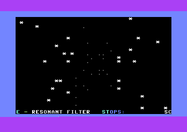

# Berlin Trip Subway — Release v1.2.4 Final Pulse Polish

C64 / ACME / VICE release of the Berlin transit true-SID-techno demo.

## Improvements

Safe final-scene polish:
- mirrored spark pairs on rows 6 and 18
- tiny centre heartbeat on row 11
- final glow rows still clear before redraw
- row 24 remains untouched except by the global scroller
- no VIC control writes
- no pointer indirection in final update

Preserved:
- SPACE skips current part/card
- Black Orbit 2 removed from final slot
- final slot uses safe `fc_init` / `fc_update`
- 26 active slots
- READY warm-start return
- verifier-first build
- PRG inspection after ACME

## Recommended workflow

```bash
cd mega
make fix-perms
make test
make
make inspect
make run
```

## Live VICE capture


