# Complete effect gallery

The production dispatch contains 26 active scenes. Each image is a native
384×272 VICE frame from the corresponding review build; the assembler-time
`START_PART` selector makes scene selection deterministic.

| # | Effect | Description | Runtime screenshot |
|---:|---|---|---|
| 0 | Title pulse field | Opens the journey with a restrained title field and music-reactive colour motion. | 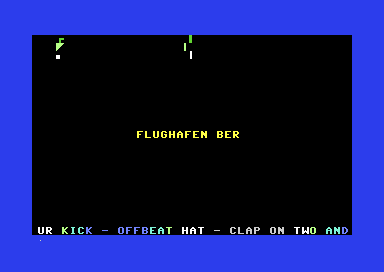 |
| 1 | Plasma storm | Interfering phase tables create a continuously changing plasma surface. | 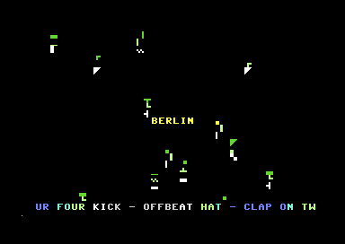 |
| 2 | Hyperspace | Fixed-point stars accelerate outward from a shared vanishing point. | 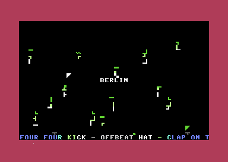 |
| 3 | XOR moire | XOR interference produces sharp rotating diamonds and high-contrast bands. | 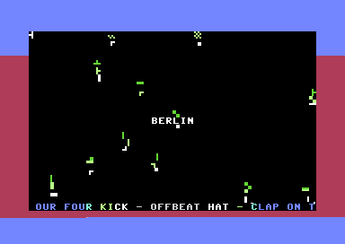 |
| 4 | Waves | Sine-displaced horizontal colour bands sweep across the character field. | 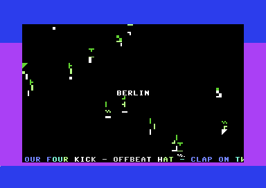 |
| 5 | Perspective tunnel | XMUL perspective, barrel warp, and forward-Z phases form a moving tunnel. | 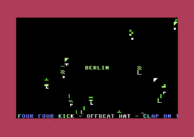 |
| 6 | Sine starfield | Fast and slow star populations drift in parallax with glowing points. | 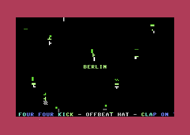 |
| 7 | Text wireframe | Row-safe text-mode geometry adapts a wireframe grid to the C64 character screen. | 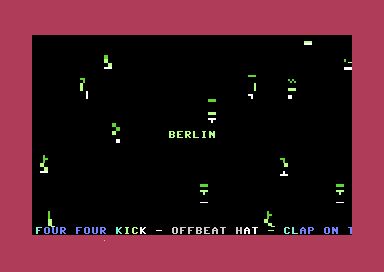 |
| 8 | Heart Voyager trail | A heart silhouette receives a moving golden trail and halo treatment. | 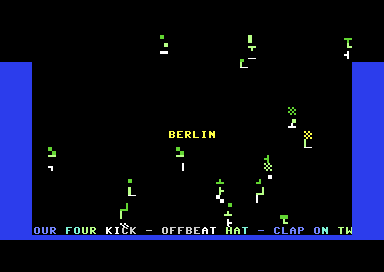 |
| 9 | Multiplex cube | Alternating edge bars translate sprite-multiplex timing ideas into text mode. | 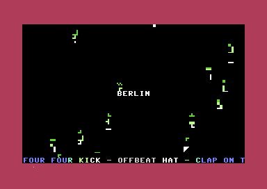 |
| 10 | Yaw wobble tunnel | Column wobble and per-cell tint give the tunnel a controlled side-to-side sweep. | 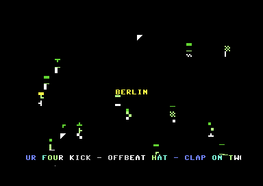 |
| 11 | Turbo boot tunnel | A faster boot-grid tunnel uses automatic zoom phases and pulse timing. | 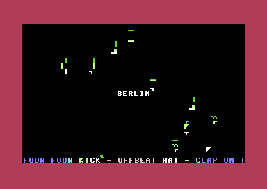 |
| 12 | Golden halo heart | A distinct animated golden halo surrounds the heart form. | 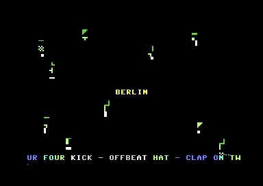 |
| 13 | Raster grid boot | Layered grid rows and raster colour changes create a boot-up field. | 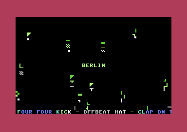 |
| 14 | Cyber grid | A neon matrix-floor adaptation combines grid geometry with SID colour response. | 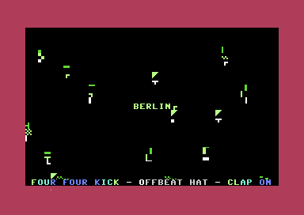 |
| 15 | Safe tunnel prime | A conservative tunnel variant uses bounded arithmetic and stable row ownership. | 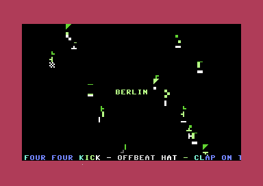 |
| 16 | Black orbit field | Orbital rings fold around a dark centre to suggest a black-hole field. | 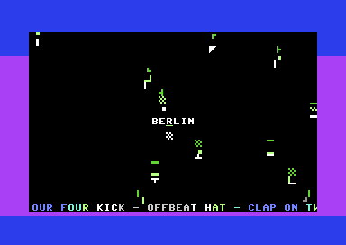 |
| 17 | Rotor cube final | A corrected 16-step cube uses projected front/back rectangles and sparse connectors. | 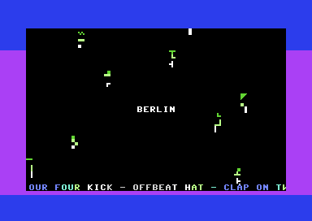 |
| 18 | Solar flare | A radial flare expands bright colour energy from a central origin. | 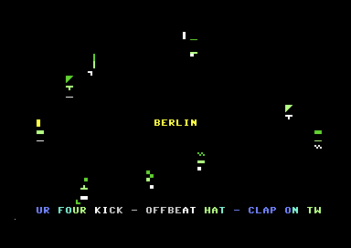 |
| 19 | Prism gate | Layered gate bars open around a colour-shifting central passage. | 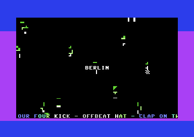 |
| 20 | Twist lattice | Phase-shifted lattice lines twist through character and colour tables. | 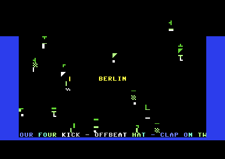 |
| 21 | Infinity corridor | Distance tables, column warp, and palette cycling create an endless corridor. | 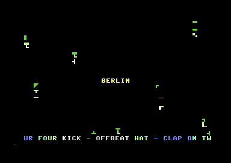 |
| 22 | Gold trench | Perspective rails, inner glow, vanishing markers, and beat crossbars define the trench. | 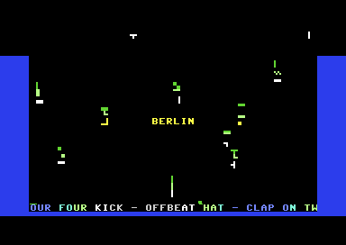 |
| 23 | Cube V3 rotor | A stable 3D cube draws front/rear planes, joints, and depth connectors. | 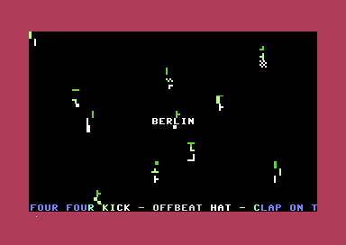 |
| 24 | Mux edge field | Alternating edge bands convert multiplex timing into safe character geometry. | 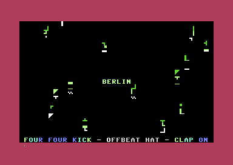 |
| 25 | Final pulse closure | The safe final slot adds mirrored sparks and a centre heartbeat without touching row 24. | 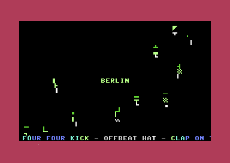 |

## Reproduce one frame

```sh
cd src
acme -DSTART_PART=25 -f cbm -o ../build/review-effect-25.prg subway.s
x64sc -autostartprgmode 1 -autostart ../build/review-effect-25.prg
```

Regenerate all captures with `./tools/capture_effects.sh`.
